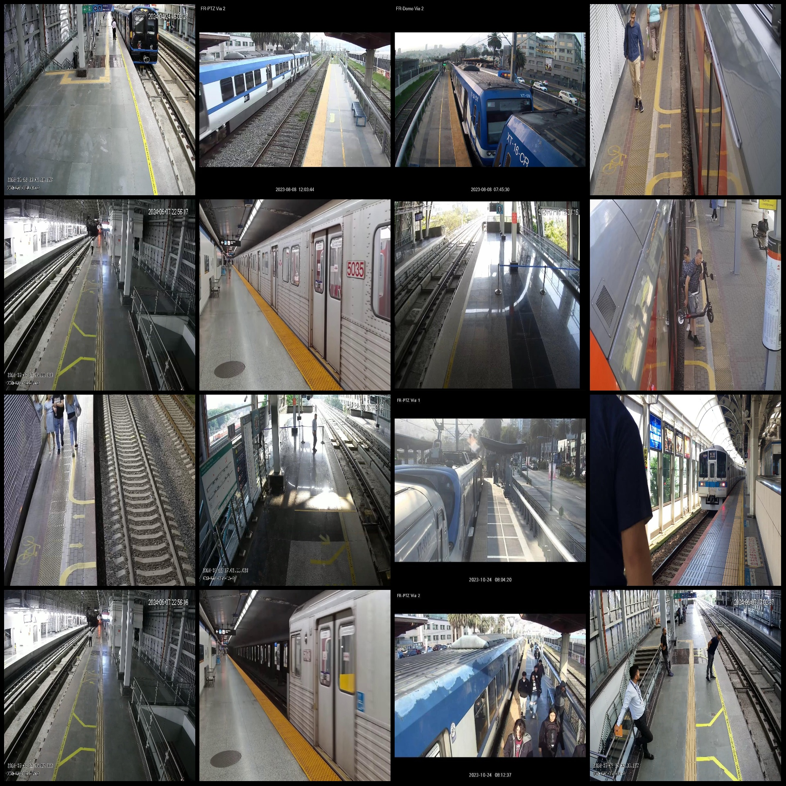
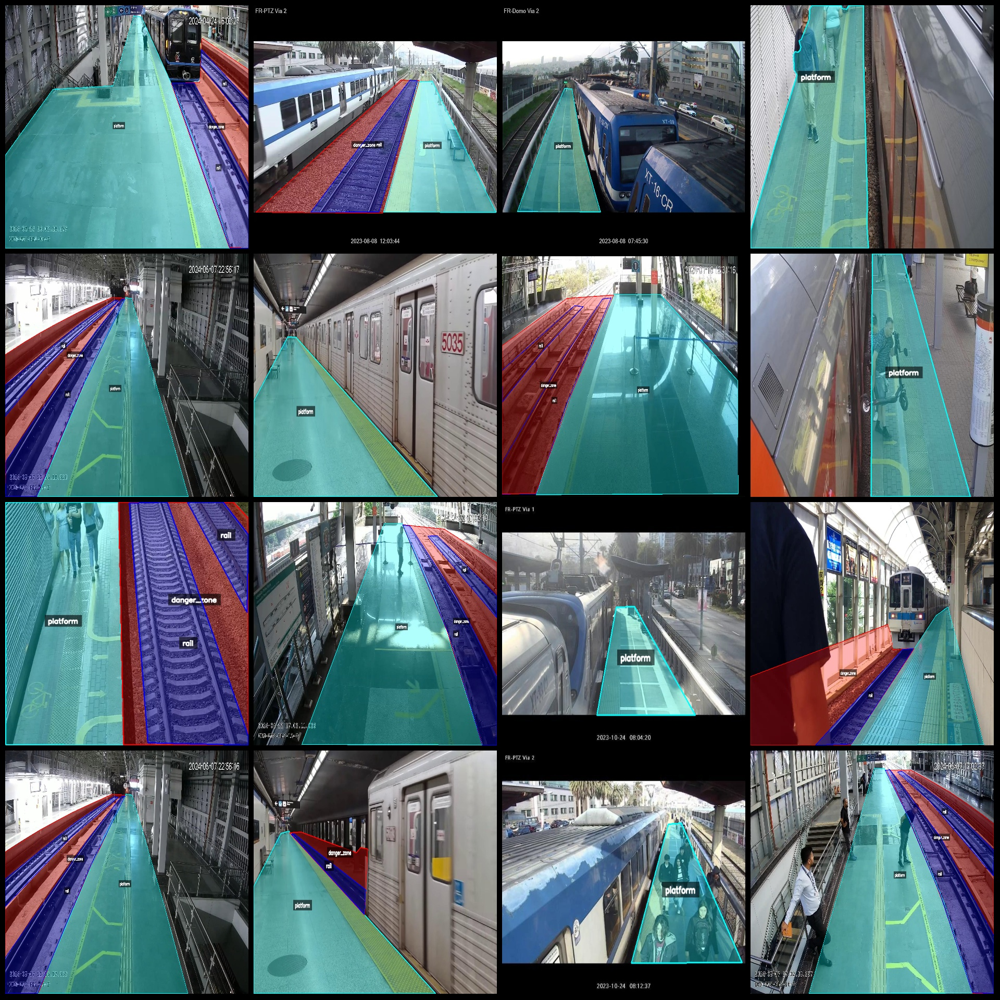
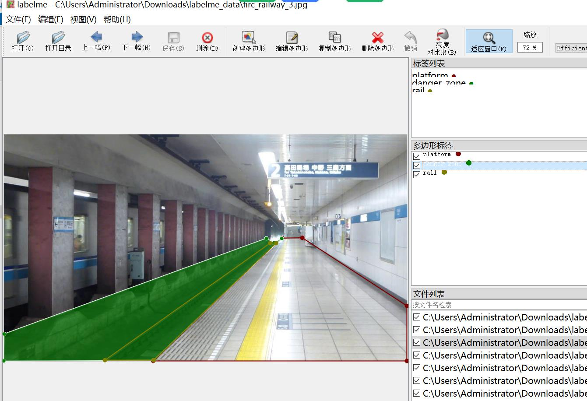

# Intelligent Railway Track Station Safety Area Identification and Segmentation Dataset - labelme format: 1780 images in 3 categories

The dataset format is labeledme (excluding the mask file, only containing jpeg images and their corresponding json files).  
Number of images (number of jpeg files): 1780  
Number of annotations (json file number): 1780  
Number of annotation categories: 3  
Annotation category names: ["danger_zone", "platform", "rail"]  
Number of boxes per category:  
danger_zone (Danger zone) count = 1113  
platform (Platform) count = 1777  
rail (Rail) count = 1910  
Total boxes: 4800  
Annotation tool used: labelme=5.5.0  
Image resolution: 1920x1080  
Annotation rule: Polygons are drawn around the categories.  
Important note: The dataset can be opened and edited using labelme, but the json dataset needs to be converted into mask or yolo or coco format for semantic segmentation or instance segmentation.  
Special declaration: This dataset does not guarantee the accuracy of the trained model or weight files.  
Image preview:  
Annotation example:  
Randomly selected 16 images for annotation:  
Annotation drawing results:  
Labelme editing image examples:

## Images

Here is a pay link on Stripe ( https://buy.stripe.com/3cs8yP7sY87d0vu9AB ). Please contact me lonlonago@foxmail.com after funding $89, and I will send you a complete data files , thank you!

